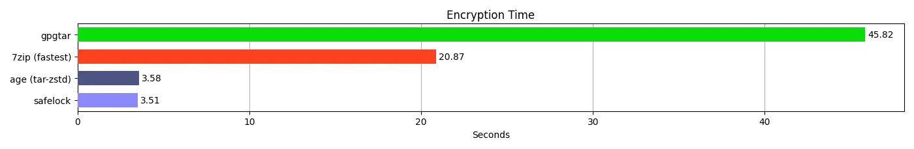

<h2></h2>
<h1>
safelock-cli
<a href='https://github.com/mrf345/safelock-cli/actions/workflows/ci.yml'>
  
</a>
<a href="https://pkg.go.dev/github.com/mrf345/safelock-cli/safelock">
  
</a>
</h1>

Fast files encryption (AES-GCM) package and command-line tool built for speed with Go and [Archiver](https://github.com/mholt/archiver) ⚡

### Install

For command-line

```shell
go install https://github.com/mrf345/safelock-cli@latest
```

For packages

```shell
go get https://github.com/mrf345/safelock-cli@latest
```

Or using one of the latest release binaries [here](https://github.com/mrf345/safelock-cli/releases)

### Examples

Encrypt a path with default options

```shell
safelock-cli encrypt path_to_encrypt encrypted_file_path
```
And to decrypt

```shell
safelock-cli decrypt encrypted_file_path decrypted_files_path
```
> [!TIP]
> If you want it to run silently with no interaction use `--quiet` and pipe the password

```shell
echo "password123456" | safelock-cli encrypt path_to_encrypt encrypted_file_path --quiet
```

You can find interactive examples of using it as a package to [encrypt](https://pkg.go.dev/github.com/mrf345/safelock-cli/safelock#example-Safelock.Encrypt) and [decrypt](https://pkg.go.dev/github.com/mrf345/safelock-cli/safelock#example-Safelock.Decrypt).

### Performance

With the default settings the encryption should be about **19.5** times faster than `gpgtar` and **10.1** times faster than `7zip` 

> [!NOTE]
> You can reproduce the results by running [bench_and_plot.py](benchmark/bench_and_plot.py) (based on [Matplotlib](https://github.com/matplotlib/matplotlib) and [Hyperfine](https://github.com/sharkdp/hyperfine))

<p align="center">
  <a href="https://raw.githubusercontent.com/mrf345/safelock-cli/master/benchmark/encryption-time.webp" target="_blank">
    
  </a>
  <a href="https://raw.githubusercontent.com/mrf345/safelock-cli/master/benchmark/decryption-time.webp" target="_blank">
    
  </a>
  <a href="https://raw.githubusercontent.com/mrf345/safelock-cli/master/benchmark/file-size.webp" target="_blank">
    
  </a>
</p>
